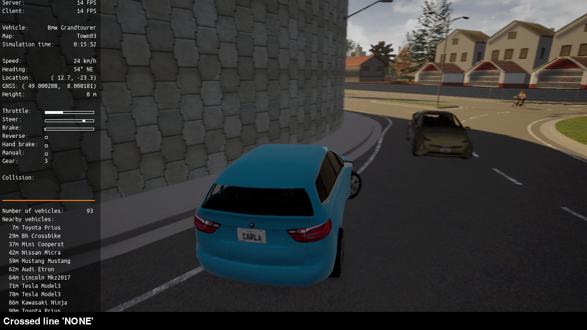
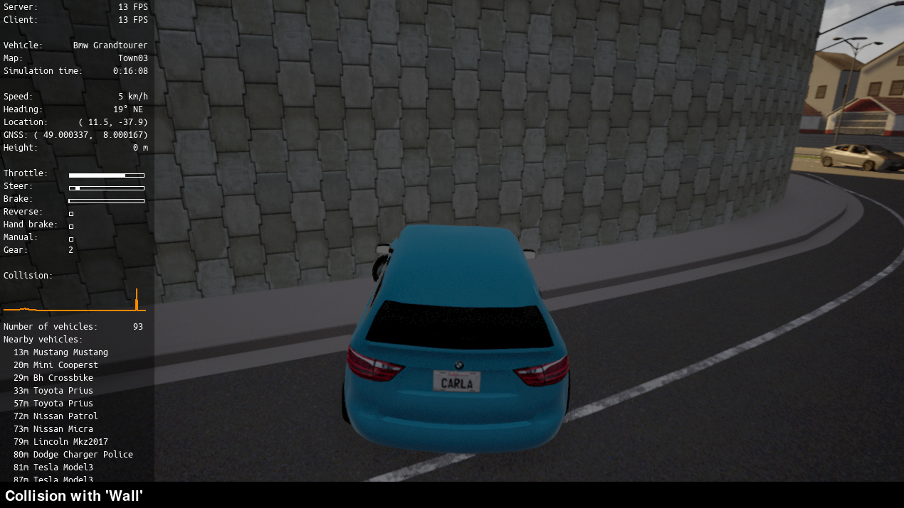

# CarlaCrasher
CarlaCrasher allows you to simulate and follow a self-driving car in [CARLA](https://www.carla.org). However, the car in crasher.py is programmed to have unpredictable movements and even break a large proportion of traffic laws to induce as many collisions as possible (as shown below). 

An analysis of the memory after these collisions can yield valuable information about their causes, including data like steering wheel movements and acceleration and speed values. CarlaCrasher is a great tool for the cyber investigation and memory analysis of self-driving cars in the CARLA simulator. In the future, I aim to creat Volatility plugins to automate the extraction of this valuable data from memory. There is also a regular self-driving car in safe_drive.py in case you want to analyze normal behavior.

# Install
Clone the repository into CARLA's PythonAPI directory, so CarlaCrasher can access the CARLA module `.egg` file.

# Run
After launching the CARLA simulator, move into the CarlaCrasher directory. 
## Configure Environment
In order to spawn cars, run `setup_cars.py`. For varying weather, run `python weather.py`. 
## Start Simulation
For the vehicle with unpredictable movements, run `python crasher.py`. If you want a regular self-driving vehicle, run `python safe_drive.py`. For both, you should see a pygame window pop up with a self-driving car.

